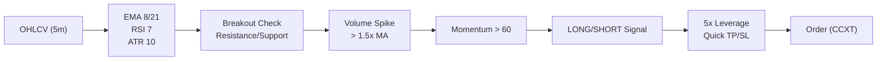

# 🚀 DBot - High-Frequency Momentum Scalper

<div align="center">


[](https://www.python.org/)
[](https://github.com/ccxt/ccxt)
[](LICENSE)

**Ein aggressiver Ultra-Short-Timeframe Momentum Scalper für maximale Rendite in kürzester Zeit**

⚠️ **HOCHRISIKO-STRATEGIE** ⚠️

[Features](#-features) • [Installation](#-installation) • [Live-Trading](#-live-trading) • [Monitoring](#-monitoring--status) • [Risiken](#%EF%B8%8F-wichtige-hinweise)

</div>

---

## 📊 Übersicht

DBot ist ein **hochaggressiver Scalping-Bot**, der auf ultra-kurzen Timeframes (1m, 5m) mit moderatem Leverage (5-10x) tradet. Die Strategie nutzt schnelle Momentum-Breakouts mit sofortigen Ein- und Ausstiegen.

### ⚡ Ziel: Maximale Rendite in kürzester Zeit

- **Aggressive Position Sizing**: 10% Risk pro Trade
- **Leverage Trading**: 5-10x Hebel für maximale Rendite
- **Ultra-Short Timeframes**: 1m/5m für viele Trades pro Tag
- **Quick Exits**: TP bei 2-5%, SL bei 1% (Risk-Reward 1:3)
- **24/7 Trading**: Bot läuft rund um die Uhr

### 🔍 Trading-Logik (Kurzfassung)

- **Momentum Detection**: EMA-Crossovers + RSI + Volume-Spikes
- **Breakout Trading**: Preis durchbricht Support/Resistance mit hohem Volumen
- **Volatility Filter**: Nur Trades bei hoher ATR-Volatilität
- **Quick Scalps**: Schnelle 2-5% Gewinne, 1% Stop Loss
- **Trailing Stop**: Nach 1.5x Risk wird SL nachgezogen
- **Multi-Asset**: BTC, ETH, SOL gleichzeitig

### 🎯 Strategie-Visualisierung



### 📈 Trade-Beispiel (LONG)

**Setup**:
- EMA8 kreuzt über EMA21 (Uptrend)
- RSI > 50 (Momentum)
- Preis bricht über 10-Kerzen Resistance
- Volume > 1.5x Average

**Execution**:
- **Entry**: 45,000 USDT (Market Order)
- **Amount**: 0.1 BTC (mit 5x Leverage = 0.5 BTC Exposure)
- **SL**: 44,550 USDT (-1%)
- **TP**: 46,350 USDT (+3%)
- **Trailing**: Nach +1.5% wird SL auf +0.5% gesetzt

**Ergebnis**: +3% = +15% mit 5x Leverage (bei Erfolg)

---

## 🚀 Features

### Trading Features
- ⚡ **Ultra-Fast Scalping** - 1m/5m Timeframes
- 🎯 **Momentum Breakouts** - EMA + RSI + Volume
- 📊 **Multi-Asset Trading** - BTC, ETH, SOL
- 💪 **Leverage Trading** - 5-10x Hebel
- 🛡️ **Risk Management** - Strikte SL/TP + Trailing
- 📱 **Telegram Alerts** - Sofort-Benachrichtigungen
- 🔄 **24/7 Automated** - Keine Ausfallzeit

### Technical Features
- ✅ CCXT Integration (Bitget)
- ✅ Real-time Market Data
- ✅ Position Management
- ✅ Robust Error Handling
- ✅ Comprehensive Logging
- ✅ Automated Execution

---

## 📋 Systemanforderungen

### Hardware
- **CPU**: Dual-Core+
- **RAM**: 2GB+
- **Speicher**: 500MB
- **Internet**: Stabile Verbindung (wichtig!)

### Software
- **OS**: Linux (Ubuntu 20.04+), macOS, Windows 10/11
- **Python**: 3.8+
- **Git**: Für Repository-Verwaltung

---

## 💻 Installation

### 1. Repository klonen

```bash
git clone https://github.com/Youra82/dbot.git
cd dbot
```

### 2. Automatische Installation

```bash
chmod +x install.sh
./install.sh
```

Das Script erstellt automatisch:
- Python Virtual Environment (`.venv/`)
- Installiert alle Dependencies
- Bereitet Ordnerstruktur vor

### 3. API-Konfiguration

Bearbeite `secret.json`:

```json
{
  "dbot": [
    {
      "name": "dbot_account",
      "exchange": "bitget",
      "api_key": "DEIN_API_KEY",
      "secret": "DEIN_API_SECRET",
      "password": "DEIN_PASSPHRASE"
    }
  ]
}
```

⚠️ **Wichtig**:
- Aktiviere nur **Spot & Futures Trading** (KEIN Withdrawal!)
- Nutze einen Sub-Account mit begrenztem Kapital
- Teste ERST im Testnet!

### 4. Trading-Parameter anpassen

Bearbeite `settings.json`:

```json
{
  "trading_parameters": {
    "leverage": 5,
    "max_open_positions": 3,
    "risk_per_trade_percent": 10,
    "stop_loss_percent": 1.0,
    "take_profit_percent": 3.0,
    "trailing_stop_activation_rr": 1.5
  }
}
```

---

## 🎮 Live-Trading

### Manueller Start

```bash
# Bot starten
python master_runner.py
```

Der Bot startet alle in `settings.json` als `"active": true` markierten Strategien.

### Automatischer Start (Cronjob)

Für 24/7 Betrieb:

```bash
crontab -e
```

Füge hinzu:

```
# DBot - Alle 5 Minuten prüfen & starten falls nicht aktiv
*/5 * * * * /usr/bin/flock -n /home/ubuntu/dbot/dbot.lock /bin/sh -c "cd /home/ubuntu/dbot && /home/ubuntu/dbot/.venv/bin/python3 /home/ubuntu/dbot/master_runner.py >> /home/ubuntu/dbot/logs/cron.log 2>&1"
```

---

## 📊 Monitoring & Status

### Status-Check

```bash
./show_status.sh
```

Zeigt:
- Aktive Prozesse
- Letzte Log-Einträge
- CPU/Memory Usage

### Live Logs

```bash
# Alle Logs
tail -f logs/dbot_*.log

# Spezifisches Symbol
tail -f logs/dbot_BTCUSDTUSDT_5m.log

# Nur Trades
tail -f logs/dbot_*.log | grep -E "Position|Signal|PnL"
```

---

## 🛠️ Wartung & Pflege

### Bot aktualisieren

```bash
chmod +x update.sh
./update.sh
```

### Tests ausführen

```bash
./run_tests.sh
```

---

## 📂 Projekt-Struktur

```
dbot/
├── src/
│   └── dbot/
│       ├── strategy/          # Trading-Logik
│       │   ├── run.py
│       │   └── scalper_engine.py
│       └── utils/             # Hilfsfunktionen
│           ├── exchange.py
│           └── telegram_notifier.py
├── scripts/
├── tests/
├── logs/
├── data/
├── artifacts/
├── master_runner.py           # Haupt-Entry-Point
├── settings.json              # Konfiguration
├── secret.json                # API-Credentials
└── requirements.txt           # Dependencies
```

---

## ⚠️ Wichtige Hinweise

### HOCHRISIKO-Strategie

🚨 **DBot nutzt eine extrem aggressive Strategie!**

- **500% Ziel in 5 Tagen** = Unrealistisch ohne enormes Risiko
- **10% Risk pro Trade** = Sehr hoch (normal: 1-2%)
- **5-10x Leverage** = Kann zu schnellen Verlusten führen
- **Ultra-Short Timeframes** = Hohe Volatilität & False Signals

### Was WIRKLICH passieren kann

❌ **Worst Case**: Totalverlust in 24-48 Stunden  
⚠️ **Wahrscheinlich**: -50% bis -80% Drawdown  
✅ **Best Case**: +100-200% (aber sehr selten!)

### Empfehlungen

1. 🧪 **Teste ZUERST im Testnet** - Mindestens 1 Woche
2. 💰 **Nutze nur Geld, das du verlieren kannst** - Ernsthaft!
3. 📉 **Erwarte Verluste** - Das ist Teil des Lernprozesses
4. 📊 **Monitor 24/7** - Sei bereit, manuell einzugreifen
5. 🛑 **Setze harte Limits** - Max Drawdown, Daily Loss Limit

### Realistischere Alternative

Wenn du langfristig Geld verdienen willst:
- **Reduziere Leverage auf 2-3x**
- **Risk pro Trade auf 2-3%**
- **Längere Timeframes (15m, 1h)**
- **Ziel: 10-20% pro Monat** (nicht 500% pro Woche!)

---

## 🤝 Support & Community

### Probleme melden

1. Prüfe Logs: `tail -f logs/dbot_*.log`
2. Führe Tests aus: `./run_tests.sh`
3. Öffne ein GitHub Issue mit Details

### Updates

```bash
git fetch origin
./update.sh
```

---

## 📜 Lizenz

MIT License - Nutze auf eigenes Risiko!

---

## 🙏 Disclaimer

⚠️ **Dieser Bot ist ein EXPERIMENT!**

- Keine Gewinngarantie
- Hohe Verlustwahrscheinlichkeit
- Nur für erfahrene Trader
- Teste ausgiebig vor Live-Einsatz
- Der Entwickler übernimmt KEINE Haftung

**Trading ist riskant. Investiere nur, was du verlieren kannst.**

---

<div align="center">

**Made with ⚡ by the DBot Team**

⭐ Star uns auf GitHub wenn dir das Projekt gefällt (trotz der Risiken!)

[🔝 Nach oben](#-dbot---high-frequency-momentum-scalper)

</div>
