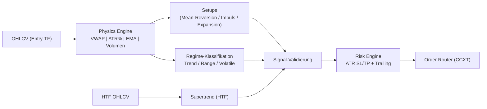

# 🚀 DBot – Physics-Inspired Crypto Bot v1.0

<div align="center">


[](https://www.python.org/)
[](https://github.com/ccxt/ccxt)
[](LICENSE)

**VWAP Mean-Reversion, Impuls→Pullback→Fortsetzung, Volatilitäts-Expansion – mit Regime-Filter & MTF-Supertrend-Bias**

[Features](#-features) • [Installation](#-installation) • [Konfiguration](#-konfiguration) • [Live-Trading](#-live-trading) • [Pipeline](#-pipeline--backtests) • [Monitoring](#-monitoring--status) • [Wartung](#-wartung)

</div>

---

## 📊 Übersicht

DBot ist ein physik-inspirierter Krypto-Trading-Bot für 15m–1d Timeframes. Er kombiniert VWAP-Mean-Reversion, Impuls-Pullback-Fortsetzung und Volatilitäts-Expansion. Ein Regime-Filter (Trend/Range/Volatile) schützt vor Overtrading; ein MTF-Supertrend-Bias verhindert Trades gegen den Higher-Timeframe-Trend.

### 🧭 Trading-Logik (Kurzfassung)
- **VWAP + Energie (Mean-Reversion)**: Preis weit weg vom VWAP, Momentum flacht ab, Volumen-Spike → Rücklauf zum VWAP
- **Impuls → Pullback → Fortsetzung**: Starker Move, 38–50% Pullback, Momentum dreht → Trend-Continuation
- **Volatilitäts-Expansion**: Enge Range mit niedrigem ATR, Breakout mit Volumen → 2–3× Range-Ziel
- **Regime-Filter**: ATR%-basiert + EMA-Alignment → Trend vs. Range vs. Volatile
- **MTF-Bias (Supertrend auf HTF)**: Nur Trades in Richtung des Higher-Timeframe-Trends
- **Risk Layer**: ATR-basiertes SL/TP, dynamisches R/R, Trailing bei 1.5R, fixed USDT-Risk

### 🔍 Strategie-Visualisierung


---

## 🚀 Features

### Trading Features
- ✅ 3 Setups: VWAP-Mean-Reversion, Impuls-Pullback-Fortsetzung, Volatilitäts-Expansion
- ✅ Regime-Filter (Trend/Range/Volatile) via ATR% + EMA-Alignment
- ✅ MTF-Bias mit Supertrend auf Higher TF (z. B. 1D für 15m/1h/4h/6h)
- ✅ 7+ Paare (BTC, ETH, SOL, ADA, AAVE, DOGE, XRP) parallel
- ✅ Timeframes: 15m, 1h, 4h, 6h, 1d
- ✅ ATR-basiertes SL/TP, dynamisches R/R, Trailing Stop
- ✅ Fixed-Risk pro Trade (USDT), Leverage konfigurierbar
- ✅ Trade-Lock-System verhindert Overtrading

### Technical Features
- ✅ CCXT Integration (Futures, USDT-M)
- ✅ Telegram Alerts (optional)
- ✅ Backtests & Pipeline-Skripte
- ✅ Cron/`flock` Ready für Ubuntu-Server
- ✅ Saubere Pfade & Logs unter `logs/`

---

## 📋 Systemanforderungen

### Hardware
- CPU: Multi-Core empfohlen
- RAM: 4GB Minimum, 8GB+ empfohlen
- Speicher: ≥2GB frei

### Software
- OS: Ubuntu 20.04+ empfohlen (läuft auch auf macOS/Windows)
- Python: 3.10+ (getestet mit 3.12)
- Git: für Deployment/Updates

---

## 💻 Installation (Ubuntu Server)

### 1) Repo klonen
```bash
git clone https://github.com/Youra82/dbot.git
cd dbot
```

### 2) Umgebung erstellen
```bash
python3 -m venv .venv
source .venv/bin/activate
pip install -r requirements.txt
```

### 3) Secrets anlegen
```bash
cp secret.json.template secret.json
```
`secret.json` ausfüllen (Beispiel für Binance USDT-M Futures):
```json
{
  "dbot": [
    {
      "name": "Binance Futures",
      "exchange": "binanceusdm",
      "api_key": "DEIN_API_KEY",
      "secret": "DEIN_SECRET",
      "sandbox": false,
      "test_mode": false
    }
  ],
  "telegram": {
    "bot_token": "DEIN_TELEGRAM_BOT_TOKEN",
    "chat_id": "DEINE_CHAT_ID"
  }
}
```
⚠️ API-Keys mit Abhebungsrechten vermeiden; IP-Whitelist nutzen.

### 4) Settings anpassen
`settings.json` steuert aktive Strategien:
```json
{
  "live_trading_settings": {
    "use_auto_optimizer_results": false,
    "active_strategies": [
      { "symbol": "BTC/USDT:USDT", "timeframe": "15m", "use_macd_filter": false, "active": true },
      { "symbol": "ETH/USDT:USDT", "timeframe": "1h",  "use_macd_filter": false, "active": true }
    ]
  }
}
```

### 5) Config pro Symbol/TF
Unter `src/dbot/strategy/configs/` liegt je Symbol/TF eine JSON. Beispiel (`config_BTCUSDTUSDT_15m.json`):
```json
{
  "market": { "symbol": "BTC/USDT:USDT", "timeframe": "15m" },
  "strategy": {
    "type": "physics",
    "enable_vwap_setup": true,
    "enable_impulse_pullback": true,
    "enable_volatility_expansion": true,
    "atr_period": 14,
    "atr_multiplier_trend": 1.5,
    "momentum_period": 10,
    "momentum_sma_period": 3,
    "volume_ma_period": 20,
    "volume_threshold": 1.2,
    "regime_atr_threshold": 0.02,
    "ema_fast": 20,
    "ema_slow": 50,
    "range_lookback": 20,
    "range_overlap_threshold": 0.7,
    "vwap_mean_reversion_threshold": 2.0,
    "momentum_threshold": 0.5,
    "sl_atr_multiplier": 1.2,
    "tp_atr_multiplier": 1.8,
    "tp_atr_multiplier_expansion": 2.5,
    "exit_on_regime_change": true,
    "exit_on_momentum_reversal": true,
    "exit_on_vwap_cross": false,
    "exit_on_energy_loss": true,
    "supertrend_atr_period": 10,
    "supertrend_multiplier": 3.0
  },
  "risk": {
    "risk_per_trade_usdt": 10,
    "leverage": 3,
    "margin_mode": "isolated",
    "min_sl_distance_pct": 0.005,
    "base_risk_reward_ratio": 2.0,
    "trailing_stop_activation_rr": 1.5,
    "trailing_stop_callback_rate_pct": 0.5
  },
  "sleep_time": 30
}
```

---

## 🔴 Live Trading

### Manuell starten (Ubuntu)
```bash
cd /home/ubuntu/dbot
source .venv/bin/activate
python src/dbot/strategy/run.py --symbol BTC/USDT:USDT --timeframe 15m --use_macd false
```

### Master Runner (alle Strategien)
```bash
cd /home/ubuntu/dbot
source .venv/bin/activate
python master_runner.py
```
Der Master Runner lädt `settings.json`, startet je aktive Strategie einen Prozess, wendet MTF-Bias an und managt Risk/Positions.

### Cron (Produktion)
```bash
crontab -e
```
Beispiel-Eintrag (alle 15 Min, keine Überlappungen dank flock):
```
*/15 * * * * /usr/bin/flock -n /home/ubuntu/dbot/dbot.lock /bin/sh -c "cd /home/ubuntu/dbot && /home/ubuntu/dbot/.venv/bin/python3 /home/ubuntu/dbot/master_runner.py >> /home/ubuntu/dbot/logs/cron.log 2>&1"
```
Log-Verzeichnis sicherstellen: `mkdir -p /home/ubuntu/dbot/logs`

---

## 📊 Pipeline & Backtests
- `run_pipeline.sh`: Interaktive Optimierungs-/Backtest-Pipeline (Optuna)
- `run_pipeline_automated.sh`: Automatisierte Pipeline
- `run_tests.sh`, `run_correct_backtest.sh/.ps1`: Tests & Backtests
- Backtest-/Optimizer-Resultate unter `artifacts/results/`

Start (Linux):
```bash
chmod +x run_pipeline.sh run_pipeline_automated.sh
./run_pipeline.sh
```

---

## 📊 Monitoring & Status
- `show_status.sh`: Übersicht aktiver Strategien, Balances, offene Positionen
- `show_results.sh`: Performance/Trades anzeigen
- Logs tailen: `tail -f logs/cron.log`

---

## 🛠️ Wartung
- Housekeeper in `trade_manager` schließt verwaiste Orders/Positions
- Trade-Lock verhindert sofortige Re-Entries
- `update.sh`: Pull & Neustart-Helfer
- `logs/` regelmäßig rotieren/prüfen

---

## ⚙️ Parameter (wichtigste Stellschrauben)
- `volume_threshold`: Energie-Filter (1.2–1.5)
- `vwap_mean_reversion_threshold`: Distanz VWAP für MR (2.0–3.0%)
- `momentum_threshold`: Mindest-Momentum für Signals (0.5–1.0)
- `regime_atr_threshold`: ATR% Schwelle Trend vs Range (0.015–0.025)
- `sl_atr_multiplier`: SL-Distanz (1.0–1.5)
- `tp_atr_multiplier`: TP-Distanz (1.5–2.5; Expansion 2.5+)

---

## 📜 Lizenz
MIT License – siehe [LICENSE](LICENSE).

---

**Made with ⚛️ Physics & 🤖 AI**# DBot – Physics-Inspired Crypto Trading

Physik-inspirierter Crypto-Bot (15m–1d) mit VWAP-Mean-Reversion, Impuls-Pullback-Fortsetzung und Volatilitäts-Expansion. Multi-Coin, Multi-TF, Regime-Filter, MTF-Bias (Supertrend auf HTF).

## Quickstart (Windows)
- `cd dbot`
- `python -m venv .venv`
- `.venv\Scripts\activate`
- `pip install -r requirements.txt`
- `copy secret.json.template secret.json` und Keys eintragen

## Run
- Einzel-Instance: `python src/dbot/strategy/run.py --symbol BTC/USDT:USDT --timeframe 15m --use_macd false`
- Master Runner: `python master_runner.py` (startet alle aktiven Strategien aus [settings.json](settings.json))

## Strategie-Kerne
- **Signal vs. Rauschen**: VWAP, MAs als Low-Pass, Volumen-Filter (Energie)
- **Momentum & Ableitung**: Geschwindigkeit (Momentum) + Beschleunigung
- **Trägheit**: Impuls → Pullback → Fortsetzung
- **Energie & Phasenwechsel**: Volumen-Spikes, Volatilitäts-Expansion aus enger Range
- **Regime**: Trend/Range/Volatile via ATR% + EMA-Alignment
- **MTF**: HTF-Supertrend als Bias, LTF für Entry

## Setups
1) **VWAP + Energie (MR)**: Weit weg vom VWAP, Momentum flacht, Volumen-Spike → Revert zum VWAP
2) **Impuls → Pullback → Fortsetzung**: Starker Move, 38-50% Pullback, Momentum dreht → Trend-Continuation
3) **Volatilitäts-Expansion**: Enge Range mit niedrigem ATR, Breakout mit Volumen → 2-3x Range-Ziel

## Dateien (wichtig)
- [src/dbot/strategy/physics_engine.py](src/dbot/strategy/physics_engine.py): Indikatoren, Regime, Impuls/Range-Checks
- [src/dbot/strategy/trade_logic.py](src/dbot/strategy/trade_logic.py): Signal-Logik + SL/TP/Exit
- [src/dbot/utils/trade_manager.py](src/dbot/utils/trade_manager.py): Order-Flow, Risk/Reward, Trailing
- [src/dbot/strategy/run.py](src/dbot/strategy/run.py): Instanz-Loop
- [master_runner.py](master_runner.py): Multi-Instance Starter
- [settings.json](settings.json): Aktive Strategien + MACD-Dummy-Flag
- [src/dbot/strategy/configs/](src/dbot/strategy/configs/): Pro Symbol/TF Parameter

## Konfiguration
1) `secret.json`: Binance USDT-M Futures Keys unter `dbot` eintragen; Telegram optional
2) [settings.json](settings.json): Strategien aktivieren/deaktivieren (Symbol, TF, use_macd ignoriert das MACD-Feature)
3) Config pro Symbol/TF anpassen (Volumen-Threshold, VWAP-Distanz, ATR-Multiplikatoren, R/R, Leverage)

## Defaults (pro Config)
- SL = 1.2x ATR, TP = 1.8x ATR (2.5x bei Expansion)
- Leverage 3x, Risk fixed in USDT, Trailing bei 1.5R, Callback 0.5%
- Volume-Filter: Ratio >= 1.2; VWAP-Distanz MR: 2.0%

## Hinweise
- Trade-Lock verhindert Overtrading; Housekeeper räumt Orders/Positions auf
- HTF-Bias muss mit Entry-Richtung alignen (keine Trades gegen 1D-Supertrend)
- Erst auf Testnet prüfen, dann live

## Lizenz
Siehe [LICENSE](LICENSE).
