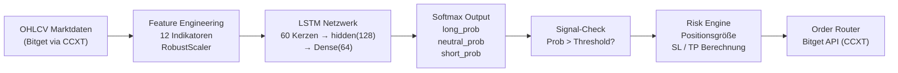

# 🧠 DBot - LSTM Deep Learning Trading Bot

<div align="center">


[](https://www.python.org/)
[](https://pytorch.org/)
[](https://github.com/ccxt/ccxt)
[](LICENSE)

**Ein LSTM-basierter Deep-Learning Trading-Bot mit automatischer Modelloptimierung – erkennt Trends und zeitliche Muster direkt aus Marktdaten**

[Features](#-features) • [Installation](#-installation) • [Konfiguration](#-konfiguration) • [Pipeline](#-interaktive-pipeline) • [Live-Trading](#-live-trading) • [Analyse](#-analyse--show_resultssh) • [Wartung](#-wartung)

</div>

---

## 📊 Übersicht

DBot ist ein Deep-Learning Trading-Bot, der ein LSTM-Netzwerk (Long Short-Term Memory) verwendet, um aus historischen Kerzendaten direkt Long-, Short- oder Neutral-Signale zu erlernen. Das Modell verarbeitet 12 technische Features über ein rollierendes Zeitfenster und lernt zeitliche Abhängigkeiten, die klassische Indikatoren nicht erfassen.

### 🧭 Trading-Logik (Kurzfassung)
- **LSTM-Klassifikation**: Das Netzwerk gibt drei Wahrscheinlichkeiten aus (Long / Neutral / Short) — gehandelt wird, wenn eine Richtung den konfigurierten Threshold überschreitet
- **Feature Engineering**: 12 normalisierte Features (RSI, MACD, Bollinger, ATR, ADX, EMA-Abstände, Volume-Ratio, etc.) als Sliding-Window-Sequenz
- **Vollautomatische Pipeline**: `run_pipeline.sh` erledigt alles in einem Schritt — LSTM einmalig trainieren, danach Signal-Thresholds + Risiko-Parameter via Optuna optimieren (kein Re-Training pro Trial)
- **Risk Engine**: Risiko-basierte Positionsgröße (% vom Startkapital / SL-Distanz), 1:2 R:R, Stop-Loss + Take-Profit als Trigger-Market-Orders
- **Cooldown**: Nach einem Stop-Loss bleibt der Bot im Cooldown bis das LSTM die Gegenrichtung signalisiert
- **Execution**: CCXT für Bitget Futures (USDT-Margin, Isolated)

### 🔍 Architektur-Visualisierung

```mermaid
flowchart LR
    A["OHLCV Marktdaten\n(Bitget via CCXT)"]
    B["Feature Engineering\n12 Indikatoren\nRobustScaler"]
    C["LSTM Netzwerk\n60 Kerzen → hidden(128)\n→ Dense(64)"]
    D["Softmax Output\nlong_prob\nneutral_prob\nshort_prob"]
    E["Signal-Check\nProb > Threshold?"]
    F["Risk Engine\nPositionsgröße\nSL / TP Berechnung"]
    G["Order Router\nBitget API (CCXT)"]

    A --> B --> C --> D --> E --> F --> G
```

### 📐 Modell-Architektur
```
Input:  (batch, seq_len=60, n_features=12)
  → LSTM(hidden=128, layers=2, dropout=0.2, batch_first=True)
  → letzter Hidden-State
  → Dense(64, ReLU)
  → Dropout(0.3)
  → Dense(3, Softmax)
Output: [long_prob, neutral_prob, short_prob]
```

### 🏷️ Label-Generierung (Training)
```
return_pct = (close[t+horizon] - close[t]) / close[t] × 100

Label 0 = LONG    → return_pct > +neutral_zone%
Label 1 = NEUTRAL → |return_pct| ≤ neutral_zone%
Label 2 = SHORT   → return_pct < -neutral_zone%
```

---

## 🚀 Features

### Deep Learning Features
- ✅ PyTorch LSTM — erkennt zeitliche Muster in Preisreihen
- ✅ 12 technische Features: RSI, MACD, Bollinger Band Breite, ATR, ADX, EMA20/50 Abstand, Volume-Ratio, Log-Return, High-Low Range, Kerzenposition
- ✅ RobustScaler-Normalisierung (robust gegen Ausreißer)
- ✅ Klassen-gewichtete Loss-Funktion (ausgeglichen bei ungleicher Label-Verteilung)
- ✅ Early Stopping + Learning-Rate-Scheduler
- ✅ Walk-Forward Split (Train / Val / Test — kein Lookahead-Bias)
- ✅ Predictor-Caching: Modell wird nur einmal pro Session geladen

### Trading Features
- ✅ 3-Klassen-Signal: Long / Neutral / Short mit konfigurierbaren Thresholds
- ✅ 1 Entry pro Signal (kein Layer-Stacking)
- ✅ Trigger-Limit Entry (0.05% Delta für quasi-sofortige Ausführung)
- ✅ 1:2 Risk:Reward — TP automatisch aus SL-Distanz berechnet
- ✅ Cooldown-Mechanismus nach Stop-Loss
- ✅ Risiko-Reduktion bei schlechter Performance (5+ Verluste in Folge → Hebel halbieren)
- ✅ Telegram-Benachrichtigungen (neue Position, Fehler)
- ✅ Performance-Tracking (Win-Rate, consecutive Losses)

### Technical Features
- ✅ CCXT Integration für Bitget Futures
- ✅ Optuna Signal-Threshold Optimierung (100+ Trials in Minuten, kein Re-Training)
- ✅ Backtesting mit realistischer Slippage-Simulation (0.05%) + Fees (0.06%)
- ✅ Automatisches OHLCV-Caching (kein erneuter Download)
- ✅ Guardian-Decorator für kritische Fehlerbehandlung
- ✅ Rotating File Logger (5 MB, 3 Backups)
- ✅ Wöchentliches Auto-Re-Training via `auto_optimizer_scheduler.py`

---

## 📋 Systemanforderungen

### Hardware
- **CPU**: Multi-Core (Training auf CPU möglich, ~5–15 Min für 50 Epochen)
- **RAM**: Minimum 2 GB, empfohlen 4 GB+
- **Speicher**: 1–2 GB (PyTorch + Modelle)
- **GPU**: Optional — automatisch genutzt wenn CUDA verfügbar

### Software
- **OS**: Linux (Ubuntu 20.04+), macOS, Windows 10/11
- **Python**: 3.8 oder höher
- **Git**: Für Repository-Verwaltung

---

## 💻 Installation

### 1. Repository klonen

```bash
git clone https://github.com/Youra82/dbot.git
cd dbot
```

### 2. Automatische Installation (empfohlen)

```bash
chmod +x install.sh
./install.sh
```

Das Install-Script:
- ✅ Erstellt `.venv` mit allen Dependencies
- ✅ Installiert PyTorch, CCXT, Optuna, scikit-learn, ta, pandas
- ✅ Legt `secret.json` aus Template an
- ✅ Erstellt alle Verzeichnisse (`artifacts/models/`, `logs/`, `data/`, etc.)
- ✅ Prüft PyTorch-Installation

### 3. API-Credentials konfigurieren

```bash
nano secret.json
```

```json
{
    "dbot": [
        {
            "name": "Bitget-Main",
            "apiKey": "DEIN_API_KEY",
            "secret": "DEIN_API_SECRET",
            "password": "DEIN_API_PASSPHRASE"
        }
    ],
    "telegram": {
        "bot_token": "DEIN_BOT_TOKEN",
        "chat_id": "DEINE_CHAT_ID"
    }
}
```

⚠️ **Wichtig**:
- `secret.json` niemals committen (steht in `.gitignore`)
- Nur API-Keys mit Trading-Rechten — keine Withdrawal-Rechte!
- IP-Whitelist auf Bitget aktivieren

### 4. Trading-Strategien konfigurieren

```json
{
    "live_trading_settings": {
        "active_strategies": [
            {
                "symbol": "BTC/USDT:USDT",
                "timeframe": "4h",
                "active": false,
                "note": "Erst aktivieren nach: run_pipeline.sh"
            }
        ]
    }
}
```

**Parameter-Erklärung**:
- `symbol`: Handelspaar im Format `BASE/QUOTE:QUOTE`
- `timeframe`: Zeitrahmen (`15m`, `30m`, `1h`, `2h`, `4h`, `1d`)
- `active`: `false` lassen bis Modell trainiert und Backtest OK ist

---

## 🔁 Interaktive Pipeline

Die komplette Workflow wird durch `run_pipeline.sh` abgebildet — von Datenabruf bis zur fertigen Config:

```bash
./run_pipeline.sh
```

### Was die Pipeline macht

`run_pipeline.sh` ruft intern nur **einen** Prozess auf — `optimizer.py` — der alles erledigt:

```
Ein Aufruf: optimizer.py
  ─────────────────────────────────────────────────────────────
  1. Daten laden
     → OHLCV von Bitget (oder aus Cache wenn < 24h alt)
     → Chronologischer Split: 80% Training | 20% Optuna-Validierung

  2. LSTM Training (einmalig — nur auf den 80% Trainingsdaten)
     → 12 technische Features berechnen (RSI, MACD, ATR, ADX, ...)
     → Labels erstellen (Long / Neutral / Short via horizon + neutral_zone)
     → RobustScaler fitten (nur auf Trainingsdaten — kein Lookahead!)
     → LSTM trainieren: Early Stopping, LR-Scheduler, klassen-gewichtete Loss
     → Modell speichern: artifacts/models/BTCUSDTUSDT_4h.pt
     → Scaler speichern: artifacts/models/BTCUSDTUSDT_4h_scaler.pkl

  3. Optuna Optimierung (KEIN Re-Training pro Trial!)
     → Vortrainiertes Modell laden (1x für alle Trials)
     → Optuna optimiert auf den 20% Validierungsdaten:
        long_threshold, short_threshold, stop_loss_pct, leverage, risk_per_entry_pct
     → Jeder Trial: Backtest in Sekunden — kein Training!
     → Beste Config speichern: src/dbot/strategy/configs/config_BTCUSDTUSDT_4h_lstm.json
  ─────────────────────────────────────────────────────────────
```

### Interaktive Eingaben

```
Handelspaar(e) (ohne /USDT:USDT, z.B. BTC ETH): BTC
Zeitfenster (z.B. 1h 4h): 4h
Anzahl Kerzen (limit) [2000]: 2000
Startkapital USDT [1000]: 1000
LSTM Training-Epochen [50]: 50
Anzahl Optuna-Trials [100]: 100
Vorhersage-Horizont (Kerzen) [5]: 5
Neutrale Zone % [0.3]: 0.3
Vorhandene Modelle überschreiben? (j/n): n
Optimierungs-Modus (1=Streng / 2=Beste): 1
Max Drawdown % [30]: 30
Min Win-Rate % [0]: 0
Min PnL % [0]: 0
```

Am Ende fragt die Pipeline optional, ob `settings.json` automatisch mit den neuen Strategien aktualisiert werden soll (analog zu ltbbot).

### Generierte Konfiguration

Nach der Pipeline liegt in `src/dbot/strategy/configs/`:

```json
{
    "market": {"symbol": "BTC/USDT:USDT", "timeframe": "4h"},
    "model": {
        "sequence_length": 60,
        "horizon_candles": 5,
        "neutral_zone_pct": 0.3,
        "long_threshold": 0.58,
        "short_threshold": 0.61
    },
    "risk": {
        "stop_loss_pct": 1.8,
        "leverage": 5,
        "risk_per_entry_pct": 1.0,
        "margin_mode": "isolated"
    },
    "behavior": {"use_longs": true, "use_shorts": true},
    "_backtest_metrics": {
        "trades": 87,
        "win_rate": 54.0,
        "pnl_pct": 42.3,
        "max_drawdown_pct": 14.1,
        "calmar_ratio": 2.99
    }
}
```

---

## 🔴 Live Trading

### Voraussetzungen

Bevor der Live-Bot gestartet wird:

1. ✅ `./run_pipeline.sh` erfolgreich abgeschlossen (Modell + Config vorhanden)
2. ✅ `./show_results.sh` → Modus 1 → Backtest-Ergebnisse geprüft
3. ✅ `settings.json` → `active: true` gesetzt (oder am Pipeline-Ende automatisch übernehmen)
4. ✅ `secret.json` mit echten API-Keys ausgefüllt

### Manueller Start (Test)

```bash
cd /home/ubuntu/dbot && .venv/bin/python3 master_runner.py
```

### Automatischer Start (Cronjob)

```bash
crontab -e
```

```
# DBot Master-Runner alle 15 Minuten
*/15 * * * * /usr/bin/flock -n /home/ubuntu/dbot/dbot.lock /bin/sh -c "cd /home/ubuntu/dbot && .venv/bin/python3 master_runner.py >> /home/ubuntu/dbot/logs/cron.log 2>&1"
```

```bash
mkdir -p /home/ubuntu/dbot/logs
```

### Was der Master Runner macht

- ✅ Liest aktive Strategien aus `settings.json`
- ✅ Startet für jede Strategie einen separaten `run.py`-Prozess
- ✅ Holt OHLCV-Daten → berechnet Features → lädt LSTM-Modell → generiert Signal
- ✅ Prüft ob TP/SL ausgelöst wurde (Tracker-Dateien)
- ✅ Platziert Entry-Order (Trigger-Limit) + SL/TP (Trigger-Market, reduceOnly)
- ✅ Sendet Telegram-Benachrichtigung bei neuer Position
- ✅ Startet `auto_optimizer_scheduler.py` im Hintergrund (wöchentliches Re-Training)

### Einzelne Strategie manuell ausführen

```bash
cd /home/ubuntu/dbot
PYTHONPATH=src .venv/bin/python3 src/dbot/strategy/run.py --symbol BTC/USDT:USDT --timeframe 4h
```

---

## 📊 Analyse & `./show_results.sh`

```bash
./show_results.sh
```

### 4 Analyse-Modi

| Modus | Beschreibung |
|-------|-------------|
| **1** | **Einzel-Analyse** — Backtest jeder trainierten Strategie isoliert (Trades, Win-Rate, PnL, Calmar) |
| **2** | **Portfolio-Simulation** — Kapital gleichmäßig aufteilen, Gesamt-PnL aller Strategien kombiniert |
| **3** | **Modell-Info** — LSTM-Architektur, Val-Accuracy, Prediction-Verteilung, aktuelles Signal |
| **4** | **Live-Status** — Tracker-Dateien, Cooldown-Status, Performance-Stats, letzte Log-Einträge |

### Modus 3 — Beispielausgabe (Modell-Info)
```
── BTC/USDT:USDT (4h) ──
LSTM: hidden=128 | layers=2 | features=12
Trainiert: seq_len=60 | horizon=5 | neutral_zone=0.3%
Val Accuracy: 58.4%

Signal-Verteilung (450 Kerzen):
  LONG:    112 (24.9%) | Threshold: 0.58
  NEUTRAL: 241 (53.6%)
  SHORT:    97 (21.6%) | Threshold: 0.61

Aktuelles Signal: LONG (p=0.631)
Optimizer-Ergebnis: PnL=+42.3% | DD=14.1% | Calmar=2.99 | Trades=87
```

### Modus 4 — Beispielausgabe (Live-Status)
```
── BTC-USDT-USDT_4h ──
Status:       ok_to_trade
Letzte Seite: long
Performance:  23 Trades | Win-Rate: 56.5% | Verluste in Folge: 1
```

---

## 📂 Projekt-Struktur

```
dbot/
├── src/
│   └── dbot/
│       ├── model/                     # Deep Learning Komponenten
│       │   ├── lstm_model.py          # PyTorch LSTM Architektur
│       │   ├── feature_engineering.py # 12 Features + Labels + Scaler
│       │   ├── trainer.py             # Training-Loop, Early Stopping
│       │   └── predictor.py           # Live-Inference mit Caching
│       ├── strategy/                  # Trading-Logik
│       │   ├── run.py                 # Entry Point je Strategie
│       │   ├── lstm_logic.py          # Signal aus LSTM-Probs
│       │   └── configs/               # Generierte JSON-Configs
│       ├── analysis/                  # Analyse & Optimierung
│       │   ├── backtester.py          # Backtest-Engine
│       │   ├── optimizer.py           # Optuna Threshold-Optimierung
│       │   └── show_results.py        # 4-Modi Analyse-Tool
│       └── utils/                     # Infrastruktur
│           ├── exchange.py            # Bitget CCXT-Wrapper
│           ├── trade_manager.py       # Trade-Zyklus, TP/SL, Tracker
│           ├── telegram.py            # Benachrichtigungen
│           └── guardian.py            # Fehler-Decorator
├── artifacts/
│   ├── models/                        # Trainierte Modelle (.pt + _scaler.pkl)
│   ├── results/                       # Optimizer-Zeitplan
│   └── tracker/                       # Per-Strategie Status-Dateien
├── data/                              # OHLCV-Cache (CSV)
├── logs/                              # Rotating Log-Files
├── train_model.py                     # CLI: LSTM trainieren
├── master_runner.py                   # Cronjob-Orchestrator
├── auto_optimizer_scheduler.py        # Wöchentliches Re-Training
├── run_pipeline.sh                    # Interaktive Pipeline (empfohlen)
├── show_results.sh                    # 4-Modi Analyse
├── run_tests.sh                       # Pytest Sicherheitsnetz
├── install.sh                         # Ersteinrichtung
├── update.sh                          # Git-Update mit secret.json Backup
├── settings.json                      # Strategie-Konfiguration
├── secret.json                        # API-Keys (nicht committen!)
├── secret.json.template               # Template für secret.json
└── requirements.txt                   # Python-Abhängigkeiten
```

---

## 🛠️ Wartung & Pflege

### Logs ansehen

```bash
# Master Runner live
tail -f logs/cron.log

# Spezifische Strategie
tail -f logs/dbot_BTCUSDTUSDT_4h.log

# Training-Log
tail -f logs/train_model.log

# Nach Fehlern suchen
grep -i "ERROR\|CRITICAL" logs/dbot_*.log
```

### Modell manuell neu trainieren

```bash
# Einfachste Methode: Pipeline neu starten mit Neutraining
./run_pipeline.sh
# → "Vorhandene Modelle überschreiben? j" eingeben

# Oder direkt via Optimizer (einmaliger CLI-Aufruf):
PYTHONPATH=src .venv/bin/python3 src/dbot/analysis/optimizer.py \
    --symbols BTC/USDT:USDT --timeframes 4h \
    --epochs 100 --trials 200 --force-retrain
```

### Modell-Cache leeren

```bash
# Gespeicherte Modelle löschen (erzwingt Re-Training)
rm -f artifacts/models/BTCUSDTUSDT_4h.pt artifacts/models/BTCUSDTUSDT_4h_scaler.pkl

# OHLCV-Cache leeren (neuer Download)
rm -f data/BTCUSDTUSDT_4h.csv

# Optimizer-Zeitplan zurücksetzen (erzwingt wöchentliches Re-Training sofort)
rm -f artifacts/results/optimizer_schedule.json
```

### Cooldown zurücksetzen

Wenn der Bot nach einem SL im Cooldown hängt:

```bash
# Tracker manuell zurücksetzen
cat artifacts/tracker/BTC-USDT-USDT_4h.json

# Status auf ok_to_trade setzen
python3 -c "
import json
with open('artifacts/tracker/BTC-USDT-USDT_4h.json') as f:
    t = json.load(f)
t['status'] = 'ok_to_trade'
with open('artifacts/tracker/BTC-USDT-USDT_4h.json', 'w') as f:
    json.dump(t, f, indent=4)
print('OK')
"
```

### Bot aktualisieren

```bash
./update.sh
```

Das Update-Script:
- Sichert `secret.json`
- `git reset --hard origin/main`
- Stellt `secret.json` wieder her
- Bereinigt Python-Cache
- Setzt Ausführungsrechte

⚠️ **Hinweis**: Trainierte Modelle (`.pt`, `.pkl`) und Configs (`configs/*.json`) bleiben erhalten — sie stehen in `.gitignore` und werden nicht überschrieben.

### Tests ausführen

```bash
./run_tests.sh

# Spezifisch
PYTHONPATH=src .venv/bin/python3 -m pytest tests/ -v
```

---

## 🔄 Auto-Optimizer (wöchentliches Re-Training)

Der `auto_optimizer_scheduler.py` läuft automatisch im Hintergrund wenn der Master Runner startet. Er prüft, ob für jede aktive Strategie ein Re-Training fällig ist.

### Verhalten

- **Intervall**: 7 Tage (konfigurierbar in `settings.json`)
- **Ablauf**: `optimizer.py --force-retrain` → LSTM neu trainieren + neue Config speichern
- **Zeitplan**: wird in `artifacts/results/optimizer_schedule.json` gespeichert

### Manuell triggern

```bash
# Zeitplan zurücksetzen → Re-Training beim nächsten Master-Runner-Start
rm artifacts/results/optimizer_schedule.json

# Oder direkt ausführen
PYTHONPATH=src .venv/bin/python3 auto_optimizer_scheduler.py
```

### Optimizer-Log überwachen

```bash
tail -f logs/auto_optimizer.log
```

### In `settings.json` konfigurieren

```json
"optimization_settings": {
    "enabled": true,
    "interval_days": 7,
    "start_capital": 1000,
    "num_trials": 100,
    "val_split": 0.2
}
```

---

## ⚠️ Wichtige Hinweise

### Risiko-Disclaimer

⚠️ **Trading mit Kryptowährungen birgt erhebliche Risiken!**

- Nur Kapital einsetzen, dessen Verlust Sie verkraften können
- LSTM-Modelle können in ungesehenen Marktregimes versagen
- Vergangene Backtest-Performance ≠ zukünftige Live-Performance
- Testen Sie ausgiebig im Paper-Trading / mit kleinen Beträgen
- `initial_capital_live` in der Config realistisch setzen

### Security Best Practices

- 🔐 Niemals API-Keys mit Withdrawal-Rechten verwenden
- 🔐 IP-Whitelist auf Bitget aktivieren
- 🔐 `secret.json` niemals committen (steht in `.gitignore`)
- 🔐 Trainierte Modelle (`.pt`) niemals committen (stehen in `.gitignore`)
- 🔐 2FA für Bitget-Account aktivieren

### Performance-Tipps

- 💡 Mit 1 Strategie starten und Logs beobachten
- 💡 `show_results.sh` → Modus 3 für aktuelles Signal nutzen bevor Strategie aktiviert wird
- 💡 `horizon_candles` und `neutral_zone_pct` je Timeframe anpassen:
  - `4h`: horizon=5, neutral_zone=0.3
  - `1d`: horizon=3, neutral_zone=0.5
- 💡 Val Accuracy > 55% ist ein gutes Zeichen — unter 52% → mehr Daten oder anderen Timeframe
- 💡 Regelmäßig `show_results.sh` → Modus 4 aufrufen um Tracker zu prüfen

---

## 🤝 Support

### Probleme melden

1. Logs prüfen: `grep -i "ERROR" logs/dbot_*.log`
2. Tests ausführen: `./run_tests.sh`
3. Modell-Info prüfen: `./show_results.sh` → Modus 3
4. Issue öffnen mit Log-Auszügen

### Updates

```bash
git fetch origin
git status
./update.sh
```

### Neue Config hochladen

```bash
git add src/dbot/strategy/configs/config_*_lstm.json
git commit -m "Update: Neue LSTM-Konfigurationen"
git push origin main
```

---

## 📜 Lizenz

Dieses Projekt ist lizenziert unter der MIT License.

---

## 🙏 Credits

Entwickelt mit:
- [PyTorch](https://pytorch.org/)
- [CCXT](https://github.com/ccxt/ccxt)
- [Optuna](https://optuna.org/)
- [Pandas](https://pandas.pydata.org/)
- [TA-Lib (ta)](https://github.com/bukosabino/ta)
- [scikit-learn](https://scikit-learn.org/)

---

<div align="center">

**Made with ❤️ by the DBot Team**

⭐ Star uns auf GitHub wenn dir dieses Projekt gefällt!

[🔝 Nach oben](#-dbot---lstm-deep-learning-trading-bot)

</div>
